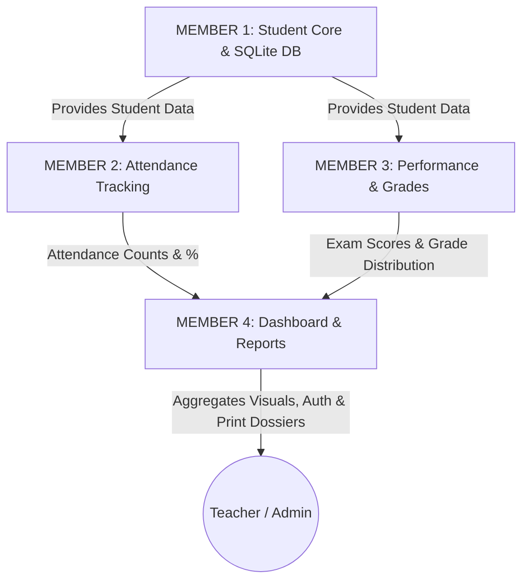

# Attendify — Team Viva & Presentation Master Guide (4-Member Team)

This guide provides an equal, balanced, and comprehensive breakdown of the **Attendify** project for a 4-member engineering team. Each member has a distinct module with clear code ownership, database responsibilities, demonstration steps, a 2–3 minute spoken presentation script, and top viva questions with answers.

---

## 👥 Team Workload & Module Allocation Summary

| Team Member | Module Name | Primary Responsibilities | Core Files Owned | Database Tables |
| :--- | :--- | :--- | :--- | :--- |
| **MEMBER 1** | **Student Management & Database Core** | Database architecture, SQLite connection, Student CRUD, search & validation, 360° student profile | `modules/student.py` `backend/database.py` `templates/students.html` `templates/add_student.html` `templates/edit_student.html` `templates/student_profile.html` | `students` `users` `settings` |
| **MEMBER 2** | **Attendance Management & Compliance** | Class attendance sheet, batch status toggles (Present/Absent/Late), atomic upsert, history log, compliance analysis (<75% threshold) | `modules/attendance.py` `static/js/attendance.js` `templates/attendance.html` `templates/attendance_history.html` `templates/attendance_analysis.html` | `attendance` |
| **MEMBER 3** | **Performance & Analytics Engine** | Internal/External marks entry, automatic percentage & standard grade logic, Chart.js visual analytics, Attendance vs Marks correlation | `modules/performance.py` `static/js/charts.js` `templates/performance.html` `templates/add_performance.html` `templates/edit_performance.html` `templates/performance_analysis.html` | `performance` |
| **MEMBER 4** | **Dashboard, Reports, UI/UX & Integration** | Executive dashboard, 6 KPI cards, printable institutional dossiers, Dark Mode, session auth, and end-to-end integration | `app.py` `modules/dashboard.py` `modules/reports.py` `templates/base.html` `templates/login.html` `templates/dashboard.html` `templates/reports.html` `templates/report_view.html` `templates/settings.html` `static/css/style.css` `static/js/main.js` | `activity_log` `settings` *(All Tables)* |

---

---

# 📌 MEMBER 1: Student Management & Database Core Module

### 🎯 Primary Responsibilities:
- Designing the SQLite relational database schema with foreign keys and unique constraints.
- Managing database connection pooling with dictionary-style row factories (`sqlite3.Row`).
- Developing full CRUD operations for students (Create, Read, Update, Delete with cascade).
- Implementing robust client-side and server-side validation to prevent duplicate roll numbers within the same class/division.
- Compiling the 360° Student Profile Dossier (`student_profile.html`).

### 📂 Key Files Owned:
- `backend/database.py` (Database schema, table initialization, sample data seeder)
- `modules/student.py` (Student CRUD logic & profile aggregation)
- `templates/students.html` (Student directory with live search and multi-filtering)
- `templates/add_student.html` & `templates/edit_student.html` (Student forms)
- `templates/student_profile.html` (Comprehensive student analytical view)

### ⚙️ Important Functions to Understand:
1. `init_db()` in `backend/database.py`: Creates tables, enforces `PRAGMA foreign_keys = ON;`, and seeds default admin.
2. `get_all_students(search, class_name, division, ...)`: SQL query with `LEFT JOIN` on attendance and performance to calculate live attendance % and average grades.
3. `add_student(data)` & `update_student(id, data)`: Regex email checks and duplicate roll-number validation query (`SELECT id FROM students WHERE roll = ? AND class_name = ? AND division = ?`).
4. `get_student_profile_data(student_id)`: Fetches attendance history, subject breakdown, and exam scores for a single student.

---

### 🗣️ Member 1: 2–3 Minute Presentation Script
> *"Good morning, respected teacher/examiner. I am responsible for **Module 1: Student Management and the Database Architecture**.*
>
> *I designed the relational schema using **SQLite3**. To ensure complete data integrity, our database enforces foreign key constraints and prevents duplicate roll numbers using composite unique keys on `(roll, class_name, division)`.*
>
> *On the application layer, I built the complete student lifecycle:*
> 1. *In the **Student Directory**, administrators can perform instant real-time searches by name, roll number, or email, and filter by class, division, attendance status, or grade.*
> 2. *When adding or editing a student, my module performs strict server-side validation on email formats, contact numbers, and roll uniqueness.*
> 3. *When you click **View Profile**, my module aggregates a 360° analytical dossier showing personal information, attendance rates, radar charts, subject scores, and history logs.*
> 4. *When a student is deleted, cascading deletion cleans up all related attendance and exam records.*
>
> *My module serves as the foundation for the entire application, as Member 2 and Member 3 directly depend on the student data provided by my backend queries."*

---

### ❓ Member 1: Top 5 Viva Questions & Model Answers

**Q1: Why did you choose SQLite over MySQL or MongoDB for this project?**
> *Answer*: SQLite is serverless, zero-configuration, and stores the entire database in a portable file (`school.db`). It provides ACID compliance, standard SQL syntax, and foreign key support without requiring external server setup, making it lightweight and reliable.

**Q2: How do you prevent duplicate roll numbers in the database?**
> *Answer*: At the database level, we defined a composite constraint: `UNIQUE(roll, class_name, division)`. At the application layer in `modules/student.py`, before executing an insert, we run a parameterized query checking if the roll number already exists for that class and division.

**Q3: What does `conn.row_factory = sqlite3.Row` do?**
> *Answer*: By default, `sqlite3` returns query results as tuples, which require accessing columns by index (e.g., `row[0]`). Setting `row_factory = sqlite3.Row` allows columns to be accessed by name (e.g., `row['name']` or `row['email']`), making the code clean and readable.

**Q4: How does Flask protect against SQL Injection in your module?**
> *Answer*: We strictly use parameterized queries with `?` placeholders (e.g., `cursor.execute("SELECT * FROM students WHERE id = ?", (student_id,))`). User input is never concatenated directly into the SQL string.

**Q5: How does deleting a student affect attendance and performance records?**
> *Answer*: In `database.py`, the `attendance` and `performance` tables define foreign keys with `ON DELETE CASCADE`. Additionally, our `delete_student()` function explicitly deletes child records to guarantee no orphaned rows remain.

---

# 📌 MEMBER 2: Attendance Management Module

### 🎯 Primary Responsibilities:
- Developing the daily class attendance marking register sheet (`attendance.html`).
- Designing segmented status toggles (`Present`, `Absent`, `Late`) and one-click batch controls (*Mark All Present*, *Mark All Absent*, *Mark All Late*).
- Implementing atomic batch upsert logic into SQLite to prevent duplicate records for the same session.
- Developing the historical attendance log with multi-filters (`attendance_history.html`).
- Computing attendance analytics and compliance categories: Excellent ($\ge 90\%$), Good ($75-89\%$), Warning ($60-74\%$), and Critical ($<60\%$).

### 📂 Key Files Owned:
- `modules/attendance.py` (Attendance sheet retrieval, batch save, analysis calculations)
- `static/js/attendance.js` (Client-side radio button batch handlers & live tally meter)
- `templates/attendance.html` (Mark attendance register sheet)
- `templates/attendance_history.html` (Historical attendance log)
- `templates/attendance_analysis.html` (Compliance dashboard & progress meters)

### ⚙️ Important Functions to Understand:
1. `get_attendance_sheet(class_name, division, subject, date_str)`: Loads all students in a class and joins with any already recorded attendance status for that date/subject.
2. `save_batch_attendance(...)`: Uses SQLite's `INSERT INTO attendance ... ON CONFLICT(student_id, date, subject) DO UPDATE SET status = excluded.status` to safely save or update records in one atomic transaction.
3. `get_attendance_analysis(...)`: Calculates percentage using $\left(\frac{\text{Present}}{\text{Total}}\right) \times 100$, determines status badges, and aggregates class summary metrics.
4. `get_attendance_history(...)`: Queries historical records with dynamic `WHERE` clauses for date range, class, division, subject, and status.

---

### 🗣️ Member 2: 2–3 Minute Presentation Script
> *"Good morning, respected teacher. I developed **Module 2: Attendance Management and Compliance Analytics**.*
>
> *The purpose of my module is to give faculty a fast, error-free, and automated way to record and monitor attendance:*
> 1. *On the **Mark Attendance** page, the teacher selects the Date, Class, Division, and Subject. The system loads the student roster with modern segmented buttons for Present, Absent, and Late.*
> 2. *I added batch action buttons like **Mark All Present** and a live tally counter to save time during lecture roll calls.*
> 3. *When saving attendance, my backend uses an atomic SQL `ON CONFLICT DO UPDATE` query. This ensures that attendance can be updated anytime without creating duplicate rows for the same student on the same day and subject.*
> 4. *In the **Attendance Analytics** section, my module calculates exact compliance percentages and categorizes students into Excellent, Good, Warning, and Critical tiers, automatically highlighting any student falling below the 75% institutional threshold.*
> 5. *Faculty can also inspect the **Attendance History Log** to filter records by date ranges, specific subjects, or individual students."*

---

### ❓ Member 2: Top 5 Viva Questions & Model Answers

**Q1: How do you prevent duplicate attendance entries if a teacher submits the form twice?**
> *Answer*: The `attendance` table has a `UNIQUE(student_id, date, subject)` constraint. When saving, we use an SQLite upsert: `INSERT INTO attendance ... ON CONFLICT(student_id, date, subject) DO UPDATE SET status = excluded.status`. If a record exists, it updates the status; otherwise, it inserts a new row.

**Q2: What is the exact formula used to calculate a student's attendance percentage?**
> *Answer*:
> $$\text{Attendance \%} = \left(\frac{\text{Present Classes}}{\text{Total Conducted Classes}}\right) \times 100$$
> If total classes is zero, the system returns `0.0%` to prevent division-by-zero runtime errors.

**Q3: What are the compliance threshold categories in your module?**
> *Answer*:
> - **Excellent**: $\ge 90\%$ (Green badge)
> - **Good**: $75\% - 89.9\%$ (Blue badge)
> - **Warning**: $60\% - 74.9\%$ (Yellow badge)
> - **Critical**: $< 60\%$ (Red badge — triggers danger alerts)

**Q4: How does the "Mark All Present" button work?**
> *Answer*: In `static/js/attendance.js`, the JavaScript function queries all input elements with `type="radio"` and `value="Present"` inside the register form, marks `.checked = true`, and dynamically updates the live tally badge display.

**Q5: How does your module connect with Member 1 and Member 4?**
> *Answer*: My module fetches student IDs and names from Member 1's `students` table via a Foreign Key relationship. In turn, my calculated attendance percentages and at-risk counts are fed directly into Member 4's Dashboard KPI cards and Reports.

---

# 📌 MEMBER 3: Performance & Analytics Engine Module

### 🎯 Primary Responsibilities:
- Creating the academic examination gradebook (`performance.html`).
- Implementing the marks entry form with separate Internal Assessment (max 40) and External Semester Exam (max 60) fields.
- Developing real-time client & server calculation of Total Marks, Percentage, and Standard Letter Grades (A+, A, B+, B, C, D, F).
- Engineering interactive **Chart.js** visual analytics (Doughnut, Bar, Horizontal Bar, Line, and Scatter/Correlation charts).
- Implementing the Attendance vs Academic Performance correlation comparison algorithm.

### 📂 Key Files Owned:
- `modules/performance.py` (Marks entry, grade logic, subject averages, pass/fail analysis)
- `static/js/charts.js` (Specialized student profile & performance distribution charts)
- `static/js/dashboard.js` (Chart.js initializations for the 5 dashboard charts)
- `templates/performance.html` (Academic Gradebook roster)
- `templates/add_performance.html` & `templates/edit_performance.html` (Marks forms with live calculation preview)
- `templates/performance_analysis.html` (Performance analytics dashboard)

### ⚙️ Important Functions to Understand:
1. `calculate_grade(percentage)`: Standard grading logic:
   - 90–100% $\to$ `A+`, 80–89% $\to$ `A`, 70–79% $\to$ `B+`, 60–69% $\to$ `B`, 50–59% $\to$ `C`, 40–49% $\to$ `D`, Below 40% $\to$ `F`.
2. `add_performance_record(...)` & `update_performance_record(...)`: Enforces valid numerical boundaries (Internal 0–40, External 0–60), computes total and percentage.
3. `get_performance_analysis(...)`: Computes class average percentage, highest/lowest scores, pass count, fail count, and subject-wise averages.
4. `get_dashboard_charts_data()`: Aggregates SQL series into JSON payloads for Chart.js.

---

### 🗣️ Member 3: 2–3 Minute Presentation Script
> *"Good morning, respected teacher. I am responsible for **Module 3: Academic Performance Tracking and Visual Analytics**.*
>
> *My module manages academic evaluation and transforms raw database numbers into meaningful visual insights:*
> 1. *In the **Gradebook**, teachers can record exam scores split into **Internal Assessment (out of 40)** and **External Semester Exam (out of 60)**.*
> 2. *As the teacher types marks in the entry form, JavaScript dynamically calculates the Total (out of 100), Percentage, and predicts the Letter Grade in real-time before submission.*
> 3. *Our grading scale follows standard university criteria from **A+ (90%+)** down to **F (below 40%)**.*
> 4. *In the **Performance Analytics** dashboard, I built interactive **Chart.js** graphs including Pass/Fail ratios, Grade Distributions, and Comparative Subject Averages.*
> 5. *One of the most powerful features I developed is the **Attendance vs Performance Correlation Chart**, which proves the direct impact of class attendance on student academic grades.*
>
> *All charts are dynamically generated from SQLite data and automatically adapt their theme when switching between Light and Dark mode."*

---

### ❓ Member 3: Top 5 Viva Questions & Model Answers

**Q1: How are marks divided and validated in your module?**
> *Answer*: Marks are divided into Internal Assessment (maximum 40) and External Examination (maximum 60), totaling 100. The backend validates `0 <= internal <= 40` and `0 <= external <= 60` and returns clear error alerts if invalid marks are submitted.

**Q2: Explain your grading algorithm.**
> *Answer*:
> - $90\% - 100\% \implies \text{A+}$ (Outstanding)
> - $80\% - 89.9\% \implies \text{A}$ (Excellent)
> - $70\% - 79.9\% \implies \text{B+}$ (Very Good)
> - $60\% - 69.9\% \implies \text{B}$ (Good)
> - $50\% - 59.9\% \implies \text{C}$ (Satisfactory)
> - $40\% - 49.9\% \implies \text{D}$ (Pass)
> - $< 40\% \implies \text{F}$ (Fail)

**Q3: How does Chart.js render real database data without page freezing?**
> *Answer*: The Flask backend aggregates query results using SQL `GROUP BY` and `AVG()` functions, converts them into Python dictionaries, and injects them into the template as JSON using Jinja2's `tojson` filter. Chart.js then initializes the canvas elements on client-side `DOMContentLoaded`.

**Q4: How does the Attendance vs Performance correlation work?**
> *Answer*: In `modules/dashboard.py`, we execute a query joining `students`, `attendance`, and `performance`, grouping by `student_id`. We calculate each student's overall attendance % alongside their average exam score %, plotting them side-by-side on a multi-bar chart to illustrate academic correlation.

**Q5: What happens to charts when Dark Mode is toggled?**
> *Answer*: In `static/js/main.js`, toggling the theme dispatches a custom `themeChanged` window event. `static/js/dashboard.js` and `charts.js` listen for this event and re-render the charts with updated grid line and font color palettes.

---

# 📌 MEMBER 4: Dashboard, Reports, UI/UX & Integration Module

### 🎯 Primary Responsibilities:
- Designing the master UI/UX layout, responsive sidebar, navigation, and Dark Mode theme system.
- Developing the main Executive Dashboard (`dashboard.html`) featuring 6 KPI summary cards, at-risk alerts, and live activity feed.
- Building the Institutional Reports Generation Hub (`reports.html`) and official printable report view (`report_view.html`).
- Implementing browser `@media print` print-to-PDF formatting with institutional letterheads and signature blocks.
- Managing user authentication, Flask sessions, `@login_required` decorators, and integrating all 4 modules into `app.py`.

### 📂 Key Files Owned:
- `app.py` (Flask application factory, routing, auth controller, global error handlers)
- `modules/dashboard.py` (Dashboard KPI metrics compiler)
- `modules/reports.py` (Report generation engines for Attendance, Performance, Dossier, Batch Summary)
- `templates/base.html` (Master layout, dark mode, toast alerts)
- `templates/login.html` (Authentication screen)
- `templates/dashboard.html` (Executive command center)
- `templates/reports.html` & `templates/report_view.html` (Printable institutional reports)
- `templates/settings.html`, `404.html`, `500.html` (Settings & Error fallbacks)
- `static/css/style.css` (CSS variables, animations, dark mode rules, print styles)
- `static/js/main.js` (Theme toggle, mobile drawer, toast auto-dismiss)

### ⚙️ Important Functions to Understand:
1. `login_required(f)` in `app.py`: Custom decorator inspecting `session.get('logged_in')` to secure all administrative endpoints.
2. `get_dashboard_metrics()`: Calculates the 6 executive KPIs: Total Students, Present Today, Absent Today, Average Attendance %, Average Exam Score %, and Count of Students Below 75%.
3. `generate_attendance_report(...)` & `generate_performance_report(...)`: Prepares letterhead metadata, applied filters, summary stats, and printable table rows.
4. `inject_global_context()`: Flask context processor injecting institutional name, academic year, and current date across all views.

---

### 🗣️ Member 4: 2–3 Minute Presentation Script
> *"Good morning, respected teacher. I am responsible for **Module 4: Dashboard, Reports, UI/UX Design, and Full System Integration**.*
>
> *My role was to integrate all the individual components built by my teammates into a cohesive, secure, and professional enterprise web application:*
> 1. *I implemented the **Authentication & Session Security System** using Flask sessions and password hashing, protecting all administrative routes with `@login_required` decorators.*
> 2. *I designed the **Executive Dashboard**, which unites Member 1's student roster, Member 2's attendance data, and Member 3's performance analytics into 6 high-level KPI cards, an At-Risk Student radar, and a live Activity Log.*
> 3. *I created the **Institutional Report Generation Hub**, allowing administrators to generate four distinct reports: Attendance Summaries, Performance Dossiers, Individual Student Dossiers, and Class Batch Summaries.*
> 4. *These reports include official college letterheads, department headers, and signature lines for Faculty, HOD, and Principal. I wrote dedicated `@media print` CSS so they print cleanly to PDF without UI buttons or sidebars.*
> 5. *Finally, I designed the modern UI design system, including responsive layouts for mobile and desktop, and a persistent **Dark Mode** toggle stored in browser `localStorage`.*
>
> *Together, our team has built a complete, fully functional software ready for real-world college deployment."*

---

### ❓ Member 4: Top 5 Viva Questions & Model Answers

**Q1: How does session management and authentication work in your application?**
> *Answer*: When a user submits valid credentials on `/login`, Flask verifies the password hash using `check_password_hash()`, creates a secure server-side session stored in signed client cookies, and stores `session['logged_in'] = True` and user details. Protected routes use a `@login_required` decorator that redirects unauthenticated requests to `/login`.

**Q2: How did you implement clean printing for official reports?**
> *Answer*: In `static/css/style.css`, we implemented an `@media print` stylesheet. When the user clicks "Print Report" (`window.print()`), the browser automatically hides the navigation sidebar, topbar, buttons (`.no-print`), and background colors, and formats the report with high-contrast text, borders, institutional letterheads, and faculty signature blocks.

**Q3: How does the Dark Mode toggle maintain the user's choice across page reloads?**
> *Answer*: In `static/js/main.js`, clicking the theme button switches the `data-bs-theme` attribute on the `<html>` root element between `"dark"` and `"light"`, and saves the selection to `localStorage.setItem('attendify_theme', theme)`. On initial load, a script checks `localStorage` and applies the user's preferred theme immediately.

**Q4: How do the 6 KPI cards on the dashboard update in real-time?**
> *Answer*: In `modules/dashboard.py`, `get_dashboard_metrics()` executes optimized SQL aggregate queries across `students`, `attendance`, and `performance` tables every time `/dashboard` is loaded, ensuring that new student enrollments, attendance marks, or exam grades immediately reflect in the metrics.

**Q5: How do all 4 modules integrate into a single Flask application?**
> *Answer*: `app.py` acts as the central controller. It imports domain functions from `modules/student.py` (Member 1), `modules/attendance.py` (Member 2), `modules/performance.py` (Member 3), and `modules/dashboard.py` & `modules/reports.py` (Member 4), maps HTTP routes to these functions, and renders the corresponding Jinja2 HTML templates.

---

## 🏆 Presentation Demonstration Sequence (10 Minutes Total)

1. **Member 4 Starts (1 min)**: Signs in with `admin` / `admin123`, showcases Executive Dashboard, 6 KPI cards, and toggles Dark Mode.
2. **Member 1 (2 min)**: Navigates to **Students**, demonstrates adding a new student with duplicate roll-number prevention, and inspects a **360° Student Profile**.
3. **Member 2 (2 min)**: Navigates to **Mark Attendance**, selects a lecture session, demonstrates "Mark All Present", changes one student to Absent/Late, and shows **Attendance Analytics** (< 75% threshold).
4. **Member 3 (2 min)**: Navigates to **Gradebook** $\to$ **Record Marks**, demonstrates real-time calculation preview of Total, Percentage, and predicted Grade, and shows the **Attendance vs Performance Correlation Chart**.
5. **Member 4 Concludes (2 min)**: Navigates to **Reports & Exports**, generates an official printable Institutional Attendance & Performance Dossier, and demonstrates the **Print / Save PDF** view with official letterhead and signature lines.
